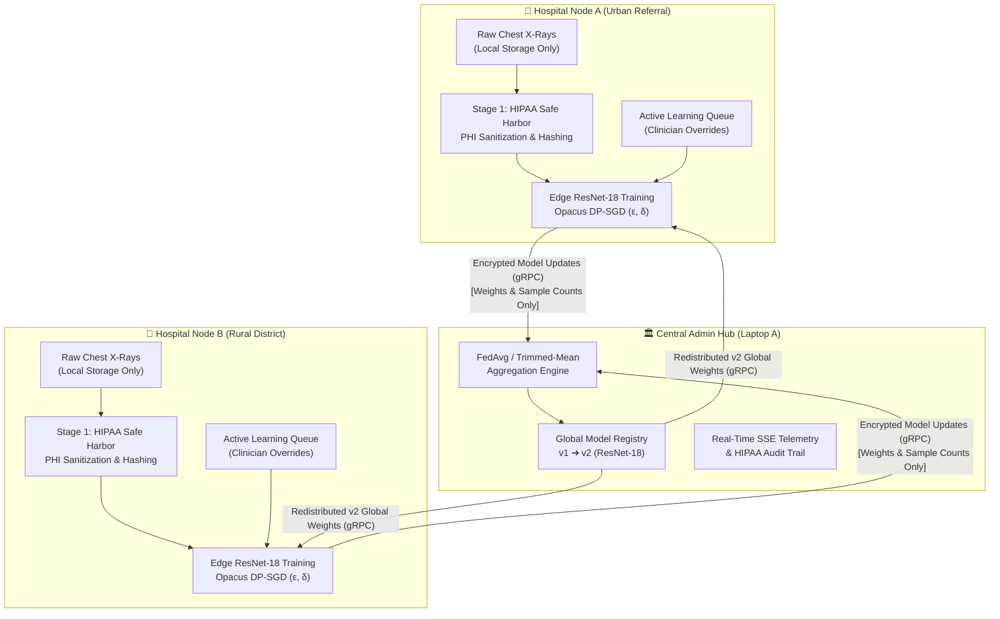
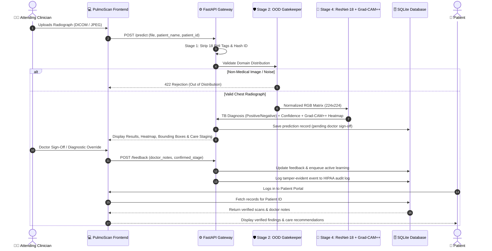

# 🫁 PulmoScan Federated Learning (FL) Platform
## Complete End-to-End Demonstration & Operational Manual

> **"Train Together. Keep Patient Radiographs Local."**  
> A privacy-preserving clinical AI platform for Tuberculosis (TB) pulmonary screening, Grad-CAM++ explainability, and multi-hospital Federated Learning with Differential Privacy.

---

## 📑 Table of Contents
1. [Architecture & System Topology](#1-architecture--system-topology)
2. [Quickstart: Launching the Platform](#2-quickstart-launching-the-platform)
3. [Authentication & Role Access Walkthrough](#3-authentication--role-access-walkthrough)
4. [Clinical Screening Workflow (Doctor & Patient)](#4-clinical-screening-workflow-doctor--patient)
5. [The Federated Learning (FL) Concept Explained](#5-the-federated-learning-fl-concept-explained)
6. [Live FL Demonstration: 3 Execution Modes](#6-live-fl-demonstration-3-execution-modes)
7. [Automated System Verification Script](#7-automated-system-verification-script)
8. [Complete Command Cheat Sheet](#8-complete-command-cheat-sheet)

---

## 1. Architecture & System Topology

The platform coordinates **Edge Clinical Nodes (Hospitals)** and a **Central Aggregation Hub (Admin)** without ever transmitting raw patient images across the network:



### Port Allocation & Service Map

| Service | Host / Port | Technology | Purpose |
| :--- | :--- | :--- | :--- |
| **FastAPI Backend** | `http://localhost:8000` | Python 3.12 / Uvicorn | Clinical inference, SQLite RBAC, active learning queue, SSE telemetry |
| **Vite Web Dashboard** | `http://localhost:5173` | React 18 / TailwindCSS | Clinician workstation, patient portal, and FL orchestrator UI |
| **Flower FL Server** | `0.0.0.0:8099` (or `8080`) | Flower / gRPC Streaming | Weight synchronization, coordinate trimmed-mean, mTLS transport |

---

## 2. Quickstart: Launching the Platform

### Terminal 1: Launch Backend API
```powershell
# In Major-Project/backend
cd c:\Users\venka\OneDrive\Desktop\major_ori_1\Major-Project\backend
python -m uvicorn main:app --reload --host 0.0.0.0 --port 8000
```
> Verify: Open [http://localhost:8000/docs](http://localhost:8000/docs) to view Swagger API schemas.

### Terminal 2: Launch Frontend Client
```powershell
# In Major-Project/Frontend
cd c:\Users\venka\OneDrive\Desktop\major_ori_1\Major-Project\Frontend
npm run dev
```
> Access UI: Open [http://localhost:5173](http://localhost:5173) in your browser.

---

## 3. Authentication & Role Access Walkthrough

The platform implements **strict Role-Based Access Control (RBAC)**. All mock switcher cards and demo popups have been removed.

```text
┌────────────────────────────────────────────────────────────────────────┐
│                        ACCESS ROLES IN PULMOSCAN                       │
├──────────────────┬───────────────────┬─────────────────────────────────┤
│ Role             │ Default Account   │ Permissions                     │
├──────────────────┼───────────────────┼─────────────────────────────────┤
│ System Admin     │ admin@pulmoscan.org│ Cluster orchestration, FL rounds│
│                  │ (AdminPass123!)   │ live telemetry, HIPAA audit logs│
├──────────────────┼───────────────────┼─────────────────────────────────┤
│ Attending Doctor │ Created by User   │ Upload CXRs, inspect Grad-CAM++,│
│                  │ via Sign Up       │ sign off findings, trigger AL   │
├──────────────────┼───────────────────┼─────────────────────────────────┤
│ Patient          │ Created by User   │ View own verified scans, doctor │
│                  │ via Sign Up       │ review notes, medication roadmap│
└──────────────────┴───────────────────┴─────────────────────────────────┘
```

### Step 3.1: Administrator Sign-In
1. Navigate to [http://localhost:5173](http://localhost:5173).
2. Click **Fill Admin** (or manually input):
   - **Email:** `admin@pulmoscan.org`
   - **Password:** `AdminPass123!`
3. Click **Sign In**.
4. **What you see:**
   - Hospital cluster status: `ONLINE_HEALTHY`
   - Active connected nodes: `2/2` (`Hospital A` and `Hospital B`)
   - Federated aggregation controls (FedAvg vs. Trimmed-Mean, DP budget monitoring)
   - Real-time HIPAA audit log streaming.

### Step 3.2: Creating a Doctor Account
1. Click **Sign Out** in the top navigation bar.
2. Select the **Create Account** tab.
3. Fill in the clinical registration form:
   - **Full Name:** `Dr. Sarah Jenkins`
   - **Email:** `sarah.jenkins@hospital.org`
   - **Password:** `DoctorPass123!`
   - **Role:** Select `Doctor / Clinician`
   - **Medical License:** `MD-94820-PULM`
   - **Hospital Node:** `Node A - Urban Referral`
4. Click **Create Clinical Account**.
5. **What you see:** Doctor's clinical screening workstation, review queue, today's scan statistics, and a button for **New CXR Analysis**.

### Step 3.3: Creating a Patient Account
1. Sign out and click **Create Account**.
2. Fill in the patient registration form:
   - **Full Name:** `Robert Chen`
   - **Email:** `robert.chen@gmail.com`
   - **Password:** `PatientPass123!`
   - **Role:** Select `Patient`
   - **Patient MRN / ID:** `PT-1001` (or leave blank for automatic hash)
3. Click **Create Clinical Account**.
4. **What you see:** Patient Health Portal displaying personal records, attending physician sign-offs, and treatment schedules. Scans uploaded by or linked to other patients are completely isolated.

---

## 4. Clinical Screening Workflow (Doctor & Patient)



### Demonstration Steps:

1. **Log in as Doctor:** (`sarah.jenkins@hospital.org` or your created doctor).
2. **Start a New CXR Ingestion:**
   - Click **+ New CXR Analysis**.
   - Input optional patient details:
     - **Patient Full Name:** `Kavya Sharma`
     - **Patient MRN / ID:** `PT-2026-904`
   - Drag & drop a Chest X-ray (`.dcm` or `.jpg`/`.png`).  
     *(Fixture available at: `Model/user test/image.jpg` or `backend/test_fixtures/sample_clinical_cxr.dcm`)*.
3. **Execute AI Inference:**
   - Click **Submit for AI-Assisted TB Screening**.
   - Observe the 5 pipeline stages:
     - **Stage 1 (HIPAA Safe Harbor):** Metadata stripped; patient hash generated.
     - **Stage 2 (OOD Gatekeeper):** Validates image as chest radiograph.
     - **Stage 4 (ResNet-18 Inference):** Returns diagnostic classification (**TB Positive** / **TB Negative**), confidence percentage, and disease staging (Stage 1 Latent to Stage 4 Cavitary).
     - **Grad-CAM++ Spatial Localization:** Renders interactive heatmap highlighting pulmonary infiltrates and anatomical lesion bounding boxes.
4. **Clinician Diagnostic Sign-Off & Active Learning Loop:**
   - Select **Confirm AI Result** or **Override AI Result**.
   - Enter Clinical Observations: `"Verified bilateral lung fields. Sputum smear negative. Routine follow-up."`
   - Click **Confirm Review**.
   - The verified finding is logged to SQLite, attributed to the clinician, and logged in the HIPAA compliance audit trail.
5. **Inspect the Patient Portal:**
   - Sign in as the patient (`PT-2026-904` or created patient).
   - Verify that the patient sees only their verified diagnosis, attending clinician's name, and personalized care roadmap.

---

## 5. The Federated Learning (FL) Concept Explained

### Why Federated Learning for Healthcare?
Traditional centralized machine learning requires aggregating thousands of confidential chest radiographs from multiple hospitals into one central server. This violates patient privacy laws (**HIPAA** in the US, **GDPR** in Europe, **DISHA** in India).

**PulmoScan Federated Learning solves this:**
1. Raw radiographs **never leave** the hospital edge workstation.
2. Training occurs **locally on premises** at each hospital node.
3. Only **anonymized parameter gradients** ($\sim 11.2\text{ MB}$) are transmitted over secure gRPC streams.
4. The central aggregator combines updates into a global model $v2$ using **FedAvg** and returns the smarter model back to all hospitals.

```text
┌────────────────────────────────────────────────────────────────────────┐
│                   FEDERATED LEARNING CORE PILLARS                      │
├─────────────────────┬──────────────────────────────────────────────────┤
│ Pillar              │ Implementation in PulmoScan                      │
├─────────────────────┼──────────────────────────────────────────────────┤
│ 1. Local Objective  │ FedProx with proximal regularization term        │
│    Optimization     │ μ = 0.01 to handle statistical heterogeneity      │
│                     │ across hospitals with diverse demographic pools. │
├─────────────────────┼──────────────────────────────────────────────────┤
│ 2. Mathematical     │ Opacus DP-SGD with Gaussian noise multiplier     │
│    Differential     │ σ = 1.0, gradient clipping C = 1.0, and privacy  │
│    Privacy (DP)     │ accounting (target ε = 8.0, δ = 1e-5).           │
├─────────────────────┼──────────────────────────────────────────────────┤
│ 3. Byzantine        │ Coordinate-wise Trimmed-Mean aggregation         │
│    Resilience       │ discards malicious/outlier gradient coordinates. │
├─────────────────────┼──────────────────────────────────────────────────┤
│ 4. Communication    │ Flower framework over gRPC streaming with 2GB    │
│    Transport        │ max message length and optional mTLS x509 certs. │
├─────────────────────┼──────────────────────────────────────────────────┤
│ 5. Active Learning  │ Real clinician diagnostic overrides are queued   │
│    Feedback Loop    │ into edge storage and retrained in the next round│
└─────────────────────┴──────────────────────────────────────────────────┘
```

---

## 6. Live FL Demonstration: 3 Execution Modes

### Mode A: Interactive Dashboard Orchestration (Recommended for Presentations)

1. Sign in as Admin (`admin@pulmoscan.org` / `AdminPass123!`).
2. Navigate to the **Federated Learning Admin Panel**.
3. In the **Federated Retraining & Distribution Controls** card:
   - **Aggregation Algorithm:** Select `FedAvg` or `Trimmed-Mean (Byzantine-Resilient)`.
   - **Differential Privacy (DP-SGD):** Toggle `Active (Opacus Gaussian Noise)`.
   - **Demo Speed:** Check `Fast Demonstration Mode` (~20s round).
4. Click **Initiate Federated Round**.
5. **Watch the Live FL Modal Animation:**
   - **Stage 1 (Broadcasting):** Global model $v1$ weights streamed to Hospital Nodes A & B.
   - **Stage 2 (Local Training):** Node A (Urban Referral) and Node B (Rural Clinic) compute local PyTorch epochs with DP noise.
   - **Stage 3 (Upload):** Serialized updates ($\sim 11.2\text{ MB}$) transmitted over gRPC/LAN.
   - **Stage 4 (Aggregation):** FedAvg aggregates weights into Global Model $v2$.
   - **Stage 5 (Promotion):** Global Model version promoted from $v1 \to v2$; validation accuracy increases; checkpoint saved to `Model/checkpoints/`.

---

### Mode B: Standalone Cluster Simulation CLI

Run an automated 3-node federated training simulation directly from your terminal:

```powershell
# In Major-Project/Model
cd c:\Users\venka\OneDrive\Desktop\major_ori_1\Major-Project\Model

python run_federated.py --rounds 3 --epochs 1 --batch_size 16 --dp --byzantine
```

**Expected Terminal Output:**
```text
=== Launching Tuberculosis Federated Learning Simulation ===
  • Algorithm:            FedProx (mu=0.01)
  • Privacy Engine:       Opacus DP-SGD (ENABLED)
  • Byzantine Resilience: Trimmed-Mean (ENABLED)
  • Transport Protocol:   Plain gRPC (0.0.0.0:8099)

Starting Flower Aggregation Server on port 8099...
Starting Flower Client for node_A...
Starting Flower Client for node_B...
Starting Flower Client for node_C...

--- Round 1 Completed. Aggregating 3 Hospital Node Updates... ---
[DP Budget] Round 1: Average epsilon = 1.55 (delta = 1e-05) across participating nodes.
[Byzantine] Applying Coordinate-wise Trimmed Mean (trim_ratio=0.1)...
Aggregated global model checkpoint saved to: Model\federated_model_dp.pth
[Evaluation] Round 1: Global Accuracy = 86.20%, Loss = 0.3214
```

---

### Mode C: Real Multi-Laptop LAN Setup (3 Physical Machines)

To run across 3 separate laptops on the same Wi-Fi network:

```text
                        LAPTOP A (Central Admin)
                        IP: 192.168.1.100
                               │
               ┌───────────────┴───────────────┐
               │                               │
       LAPTOP B (Hospital A)           LAPTOP C (Hospital B)
       IP: 192.168.1.101               IP: 192.168.1.102
```

1. **On Laptop A (Central Admin & Server):**
   ```powershell
   cd Major-Project
   # Start Flower gRPC Server:
   python -m src.federated.server --rounds 5 --port 8099 --min_clients 2
   ```

2. **On Laptop B (Hospital A - Urban Referral):**
   ```powershell
   cd Major-Project
   python Model\run_hospital_node.py --node_id node_A --server 192.168.1.100:8099 --api_server http://192.168.1.100:8000
   ```

3. **On Laptop C (Hospital B - Rural Clinic):**
   ```powershell
   cd Major-Project
   python Model\run_hospital_node.py --node_id node_B --server 192.168.1.100:8099 --api_server http://192.168.1.100:8000
   ```

Both hospital laptops train on their locally isolated radiographs and transmit parameter updates to Laptop A over gRPC without raw data ever crossing machine boundaries.

---

## 7. Automated System Verification Script

Run the master test suite to verify all 5 stages of the pipeline in a single execution:

```powershell
# In Major-Project root
cd c:\Users\venka\OneDrive\Desktop\major_ori_1\Major-Project
python test_end_to_end.py
```

### Verification Criteria Checklist:

- [x] **[STAGE 1] DICOM De-Identification:** 18 PHI tags stripped; SHA-256 patient pseudonym generated.
- [x] **[STAGE 2] OOD Gatekeeper:** Solid black and non-medical images rejected with 422 status.
- [x] **[STAGE 3] Federated Learning:** FedProx loss formulation, Byzantine coordinate trimming, and mTLS cert generation pass.
- [x] **[STAGE 4] ResNet-18 TB Diagnosis:** Inferences, disease staging (1–4), and Grad-CAM++ localization execute cleanly.
- [x] **[STAGE 5] Doctor Review & AL Queue:** Clinician override recorded to SQLite and queued for the next FL round.

---

## 8. Complete Command Cheat Sheet

| Task | Command | Directory |
| :--- | :--- | :--- |
| **Start Backend API** | `python -m uvicorn main:app --reload --port 8000` | `Major-Project/backend` |
| **Start Frontend UI** | `npm run dev` | `Major-Project/Frontend` |
| **Build Frontend** | `npm run build` | `Major-Project/Frontend` |
| **Run Full Test Suite** | `python test_end_to_end.py` | `Major-Project` |
| **Run FL Simulation** | `python run_federated.py --rounds 3 --dp` | `Major-Project/Model` |
| **Start FL gRPC Server** | `python -m src.federated.server --port 8099 --min_clients 2` | `Major-Project/Model` |
| **Start FL Hospital Client** | `python -m src.federated.client --node node_A --server localhost:8099` | `Major-Project/Model` |
| **Inspect SQLite DB** | `sqlite3 feedback.db "SELECT * FROM predictions;"` | `Major-Project/backend` |
| **Reset DB for Clean Demo** | `python -c "from database import init_db, seed_default_users_and_scans; init_db(); seed_default_users_and_scans()"` | `Major-Project/backend` |
| **Check gRPC & Flower** | `python -c "import flwr, grpc; print(flwr.__version__, grpc.__version__)"` | Any |
