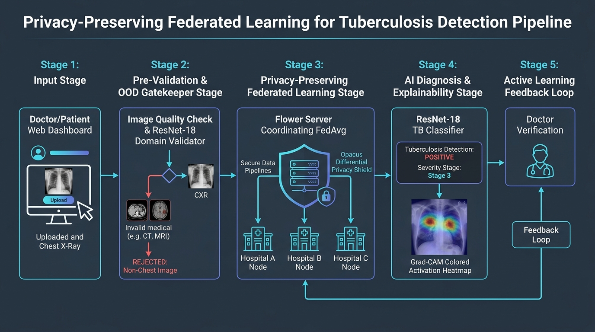

# Tuberculosis Detection Pipeline with Chest X-Ray Domain Validator & OOD Detector

This project provides a robust **Chest X-Ray Domain Validator / Out-Of-Distribution (OOD) Detector** integrated ahead of an existing Tuberculosis (TB) classification model.

The validator front-ends the system to ensure that **only appropriate Chest X-Ray (CXR) images** are passed to the existing TB model. All invalid non-chest images, medical OOD modalities, and corrupted files are **rejected**, preventing the TB model from executing on improper inputs.

---

## 1. System Architecture & Gatekeeper Workflow



```text
               Uploaded Image / Input Path
                           ↓
        ┌──────────────────────────────────────┐
        │ 1. Pre-Validation & Quality Check    │
        │    (Corrupt file, blank, saturated)  │
        └──────────────────┬───────────────────┘
                           │ Pass (Intact)
                           ↓
        ┌──────────────────────────────────────┐
        │ 2. Chest X-Ray Validator (ResNet-18) │
        └──────────────────┬───────────────────┘
                           │
             ┌─────────────┴─────────────┐
             ▼                           ▼
       Probability ≥ Threshold     Probability < Threshold
       (VALID Chest X-Ray)        (INVALID / OOD Image)
             │                           │
             ▼                           ▼
  ┌──────────────────────┐    ┌──────────────────────┐
  │ 3. Existing TB Model │    │ Reject with Reason   │
  │    (ResNet-18 Head)  │    │                      │
  └──────────┬───────────┘    └──────────────────────┘
             │                  (TB Model NEVER Called)
             ▼
    Prediction Output
  [Normal / Tuberculosis]
            +
    Medical Disclaimer
```

---

## 2. Directory Structure

```text
project/
├── data/
│   ├── valid_chest_xray/         # Held-out Chest X-Rays (train, val, test)
│   └── invalid/                  # Categorized non-CXR / OOD images
│       ├── skin/                 # DermaMNIST
│       ├── blood_tissue/         # PathMNIST / BloodMNIST
│       ├── ct_mri_ultrasound/    # OrganAMNIST (Abdominal CT projections)
│       ├── photographs/          # General non-medical images
│       └── unseen_ood/           # OCTMNIST (Held out completely from train & val!)
├── models/
│   ├── validator/                # Stores chest_xray_validator.pth & validator_config.json
│   └── existing_tb_model/        # Directory for existing TB model checkpoint (tb_resnet18.pth)
├── prepare_validator_data.py    # Downloads MedMNIST & prepares balanced train/val/test splits
├── train_validator.py           # Trains ResNet-18 binary domain validator
├── threshold_selection.py       # Validation-set threshold optimizer (FAR/FRR trade-off)
├── evaluate_validator.py        # Evaluates untouched test set with category-wise FAR/FRR
├── inference.py                 # Single predict(image) entrypoint with gatekeeper logic
├── requirements.txt             # Project dependencies (torch, torchvision, medmnist, etc.)
└── README.md                    # Documentation
```

---

## 3. Getting Started & Installation

### Environment Setup
Activate your Python virtual environment and install dependencies:

```powershell
# Activate virtual environment
.\venv\Scripts\Activate.ps1

# Install requirements
python -m pip install -r requirements.txt
```

---

## 4. Step-by-Step Execution Guide

### Step 1: Prepare Validator Dataset & Class Balance
Download MedMNIST datasets, generate non-medical photograph controls, collect chest X-rays, and create leakage-free `train`, `val`, and `test` splits:

```powershell
python prepare_validator_data.py
```

*Output: Creates `data/` structure with balanced counts:*
- **VALID (Chest X-Ray)**: 350 Train | 75 Val | 75 Test
- **INVALID (skin, blood_tissue, ct, photographs)**: 1400 Train | 300 Val | 300 Test
- **INVALID (unseen_ood - OCT Retinal)**: 0 Train | 0 Val | 150 Test *(Held out completely for zero-shot testing)*

---

### Step 2: Train the ResNet-18 Validator
Train the ResNet-18 domain validator on the seen training split:

```powershell
python train_validator.py --epochs 5 --lr 1e-4
```

*Output: Saves best weights to `models/validator/chest_xray_validator.pth`.*

---

### Step 3: Select Optimal Threshold on Validation Set
Optimize decision threshold on the **validation set**, prioritizing a low **False Acceptance Rate (FAR)** without forcing a rigid cutoff:

```powershell
python threshold_selection.py --alpha 0.85
```

*Output: Saves optimal threshold and calibration parameters to `models/validator/validator_config.json`.*

---

### Step 4: Comprehensive Evaluation on Untouched Test Set
Evaluate the trained validator on the test set (including the zero-shot unseen OOD category):

```powershell
python evaluate_validator.py
```

*Output: Calculates Accuracy, Precision, Recall/Sensitivity, Specificity, F1, ROC-AUC, PR-AUC, overall FAR/FRR, category-wise FAR/FRR, and saves `validator_confusion_matrix.png`.*

---

### Step 5: Run Unified Inference (`predict(image)`)
Use `inference.py` to run end-to-end inference on any input image:

```powershell
python inference.py --image "data/valid_chest_xray/test/valid_cxr_0000.png"
```

#### Providing Existing TB Model Path
Specify your existing TB model path via parameter or place checkpoint at `models/existing_tb_model/tb_resnet18.pth`:

```powershell
python inference.py --image "data/valid_chest_xray/test/valid_cxr_0000.png" --tb_model_path "centralized_model.pth"
```

#### Python API Usage:
```python
from inference import predict

# Run end-to-end prediction
result = predict("path/to/image.png", tb_model_path="centralized_model.pth")

print(result)
# Output Example (Accepted):
# {
#     "is_valid": True,
#     "status": "ACCEPTED",
#     "validator_probability": 0.9982,
#     "tb_prediction": "Normal",
#     "tb_confidence": 0.9854,
#     "medical_disclaimer": "TB output is a model prediction, not a definitive medical diagnosis."
# }
```

---

## 5. Domain Validation vs. Advanced OOD Detection

- **Binary Domain Validator (Implemented)**: A supervised ResNet-18 CNN trained to separate target in-domain samples (Chest X-Rays) from out-of-domain categories.
- **Advanced Unsupervised OOD Detection**: Methods like Mahalanobis feature distance, Softmax Energy scores, or Maximum Softmax Probability (MSP) thresholding designed for open-world novelty detection without explicit negative supervision.

---

## 6. Medical Disclaimer

> **IMPORTANT MEDICAL DISCLAIMER**:
> Tuberculosis predictions returned by this system are model outputs generated by artificial intelligence algorithms and do **NOT** constitute a definitive medical diagnosis. All predictions must be reviewed by a licensed healthcare professional or radiologist.
